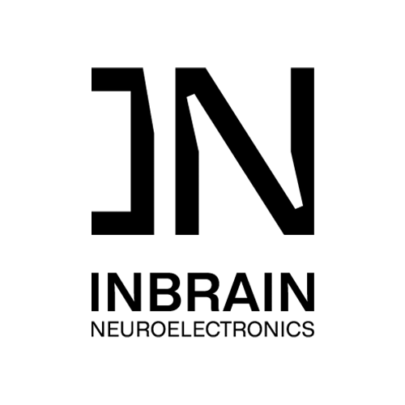
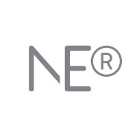

## Experience

<table>
    <thead>
        <tr>
            <th>Company</th>
            <th>Link</th>
            <th>Role</th>
            <th>Dates</th>
            <th>Location</th>
        </tr>
    </thead>
    <tbody>
        <tr>
            <td></td>
            <td><a href="https://inbrain-neuroelectronics.com/" target="_blank">INBRAIN Neuroelectronics</a></td>
            <td>Embedded Software Engineer & Scrum Master</td>
            <td>2025 – Present</td>
            <td>Barcelona, ES</td>
        </tr>
        <tr>
            <td rowspan=4></td>
            <td rowspan=4><a href="https://www.neuroelectrics.com/" target="_blank">Neuroelectrics</a></td>
        </tr>
        <tr>
            <td>Software Engineer & Scrum Master</td>
            <td>2024 – 2025</td>
            <td>Barcelona, ES</td>
        </tr>
        <tr>
            <td>Software Engineer (Embedded & Desktop Applications)</td>
            <td>2022 – 2024</td>
            <td>Barcelona, ES</td>
        </tr>
        <tr>
            <td>Junior Software Engineer</td>
            <td>2020 – 2022</td>
            <td>Barcelona, ES</td>
        </tr>
        <tr>
            <td></td>
            <td><a href="https://eel.upc.edu/es" target="_blank">UPC — EEL EETSETB</a></td>
            <td>Research Intern in Electronics Engineering</td>
            <td>Mar 2020 – Jun 2020</td>
            <td>Barcelona, ES</td>
        </tr>
        <tr>
            <td></td>
            <td><a href="https://www.linkedin.com/company/sptbcn/" target="_blank">SPTBCN</a></td>
            <td>Electronics Engineer & Project Manager Trainee</td>
            <td>2019 – 2020</td>
            <td>Barcelona, ES</td>
        </tr>
    </tbody>
</table>

---

## Education

<table>
    <thead>
        <tr>
            <th>School</th>
            <th>Link</th>
            <th>Degree</th>
            <th>Date</th>
        </tr>
    </thead>
    <tbody>
        <tr>
            <td></td>
            <td><a href="https://london.ac.uk/" target="_blank">University of London</a></td>
            <td>MSc in Artificial Intelligence</td>
            <td>2022 – 2024</td>
        </tr>
        <tr>
            <td></td>
            <td><a href="https://www.upc.edu/" target="_blank">Polytechnic University of Catalonia</a></td>
            <td>BEng in Telecommunication Technologies & Services Engineering</td>
            <td>2016 – 2020</td>
        </tr>
    </tbody>
</table>

---

## Open Source Contributions

<table>
  <thead>
    <tr>
      <th>OSS Project</th>
      <th>Link</th>
      <th>Details</th>
      <th>Date</th>
    </tr>
  </thead>
  <tbody>
    <tr>
      <td></td>
      <td><a href="https://github.com/apache/mynewt-nimble" target="_blank">Apache myNewt nimBLE</a></td>
      <td>Bugfixes in FreeRTOS port  & compatibility with clang compiler</td>
      <td>2025</td>
    </tr>
    <tr>
      <td></td>
      <td><a href="https://github.com/rnag/dataclass-wizard" target="_blank">dataclass-wizard</a></td>
      <td>Bugfix for timezone parsing  in Python 3.9+</td>
      <td>2024</td>
    </tr>
  </tbody>
</table>

---

## Certifications & Courses

<table>
  <thead>
    <tr>
      <th>Course / Certification</th>
      <th>Date</th>
    </tr>
  </thead>
  <tbody>
    <tr>
      <td>Applied ISO14971 Medical Device Risk Management</td>
      <td>2022</td>
    </tr>
    <tr>
      <td>Git Mindset: Underlying Architecture of Git</td>
      <td>2022</td>
    </tr>
    <tr>
      <td>FreeRTOS and STM32Fx</td>
      <td>2025</td>
    </tr>
    <tr>
      <td>Object Oriented Programming with Python3</td>
      <td>2023</td>
    </tr>
    <tr>
      <td>Principles of Secure Coding</td>
      <td>2024</td>
    </tr>
  </tbody>
</table>

---